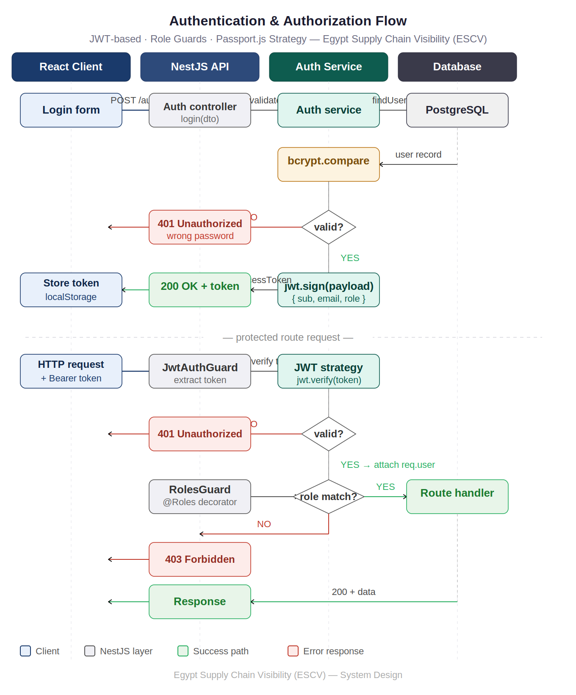
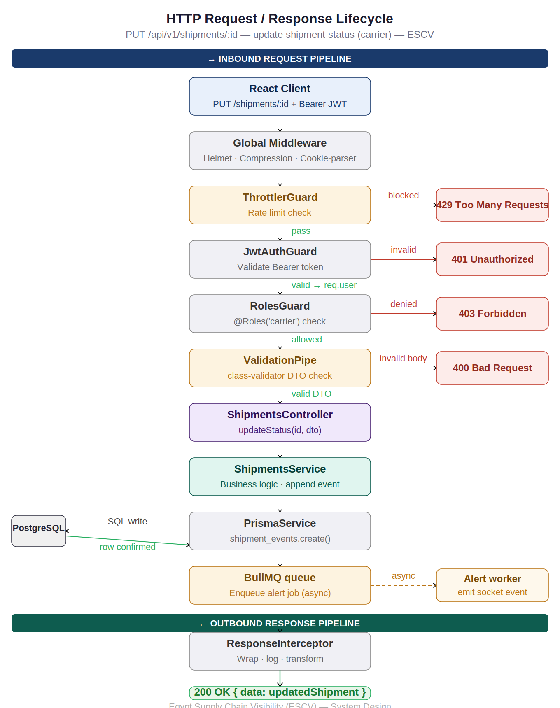
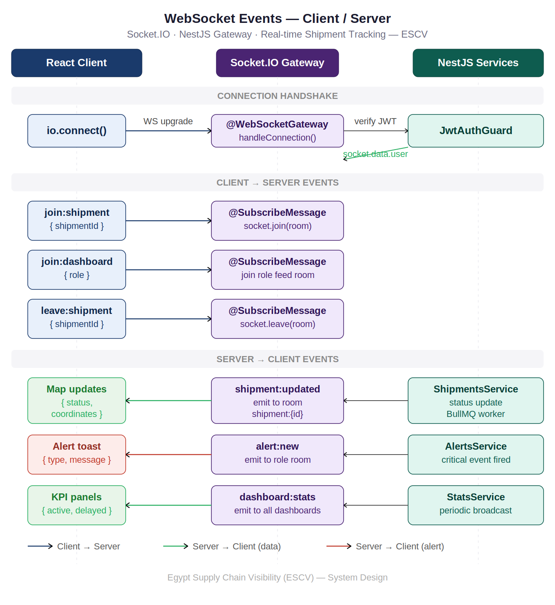

# Egypt Supply Chain Visibility (ESCV)

> Developed by **Ahmed Medhat**, **Ebram Samy**, **Ahmed Tarek**, & **Lucas Monir**

<div align="center">
  
</div>

---

## Project Overview
**Egypt Supply Chain Visibility (ESCV)** is a production-grade, full-stack national supply chain visibility platform engineered to bring real-time transparency to Egypt's trade and logistics ecosystem. Egypt sits at the center of global trade the Suez Canal alone moves 12% of world trade yet supply chains across the country are still tracked through phone calls and paper. Delays at ports, customs holds, and missed deliveries persist because no one has a clear, unified view of what's moving where.

**ESCV solves this.** A live national dashboard where shippers, carriers, and regulators can track shipments in real time, receive intelligent alerts the moment something goes wrong, and trace every event from origin to delivery. Built specifically for Egypt's ports, routes, and trade ecosystem.

The core architecture is built around **event-driven async pipelines**, **WebSocket-powered live map updates**, **role-based access control**, and a **queue-based alert system** — ensuring every stakeholder sees accurate, live shipment data without delay.

**Project Type:** Full-Stack Web Application — University Capstone Project  
**License:** Proprietary – All rights reserved

---
# Application System Design
## The Real Problem
Egypt processes millions of shipments annually through Alexandria Port, Port Said, and Damietta. A cargo container leaves Shanghai. It arrives at Alexandria Port. Customs holds it. The shipper finds out two days later via a phone call. The carrier doesn't know. The regulator has no record.

Now multiply that across thousands of shipments per day.

The entire backend architecture of ESCV exists to eliminate this blind spot one source of truth, visible to every stakeholder in real time.

**Authentication Flow:**
## ESCV - Authentication Flow Architect

*ESCV - Authentication Flow Architect*

**Request/Response Lifecycle:**
## ESCV - Request/Response Lifecycle Architect

*ESCV - Request/Response Lifecycle Architect*

**WebSocket Events:**
## ESCV - WebSocket Events Architect

*ESCV - WebSocket Events Architect*

---

## Key Technical Decisions
| Problem | Solution | Why |
|---|---|---|
| Live shipment tracking | Socket.IO rooms per shipment | Every status change broadcasts instantly to relevant stakeholders |
| Alert delivery | BullMQ async queue | Alert processing never blocks the main request cycle |
| Role-based visibility | JWT claims + NestJS Guards | Shippers see their cargo, carriers see their routes, regulators see everything |
| Shipment state history | Append-only event log in PostgreSQL | Full audit trail from origin to delivery, never overwrite |
| High-frequency reads | Redis cache layer | Port dashboards read shipment state from cache, not DB on every request |
| Message brokering | RabbitMQ via NestJS Microservices | Decoupled event publishing between services for scale |
| API security | Helmet + throttler + JWT | Rate limiting, header hardening, and signed auth tokens |

---
## Tech Stack

### Frontend
| Technology | Purpose | Version |
|---|---|---|
|  | UI Library | 18.x |
|  | Language | 5.x |
|  | Styling | 3.x |
|  | Client-side Routing | 6.x |
|  | Live Map Rendering | 3.x |
|  | Analytics & Charts | 2.x |
|  | Global State | 4.x |
|  | Server State & Caching | 5.x |
|  | HTTP Client | 1.x |
|  | Icons | 7.x |

---
## Project Structure
### Root
```js
egypt-supply-chain-visibility/
├── client/
├── database/
├── docs/
├── server/
└── README.md
```

---
## Role-Based Access Control

| Role | Capabilities |
|---|---|
| **Shipper** | Create shipments, view own cargo, receive alerts |
| **Carrier** | Update shipment location & status, view assigned routes |
| **Regulator** | Read-only national dashboard, full visibility, export reports |
| **Admin** | Manage users, carriers, routes, and platform configuration |

Access is enforced at the API layer via **JWT claims + NestJS Role Guards** — every endpoint checks the token role before executing.

---
## Installation
### Prerequisites
- Node.js 20+
- Git

### Backend Setup (Manual)
```bash
# Core NestJS setup
npm install @nestjs/config

# Validation (DTO validation)
npm install class-validator class-transformer

# Authentication & Security
npm install @nestjs/passport passport passport-jwt
npm install @nestjs/jwt bcrypt
npm install -D @types/bcrypt

# Database (PostgreSQL + Prisma ORM)
npm install prisma --save-dev
npm install @prisma/client
npm install pg

# Redis (Caching + real-time optimization)
npm install redis

# RabbitMQ (Event-driven architecture / message broker)
npm install @nestjs/microservices amqplib amqp-connection-manager

# WebSockets (Real-time tracking updates)
npm install @nestjs/websockets @nestjs/platform-socket.io

# API Documentation (Swagger)
npm install @nestjs/swagger swagger-ui-express

# Security Middleware
npm install helmet compression cookie-parser
npm install -D @types/cookie-parser

# Logging (Production-grade logs)
npm install nestjs-pino pino-http

# Environment Validation
npm install joi

# Utilities
npm install dayjs uuid
npm install -D @types/uuid

# Rate limiting (optional protection)
npm install @nestjs/throttler

# Testing tools
npm install supertest
npm install -D @types/supertest
```

### Frontend Setup (Manual)
```bash
# Create React app (Vite recommended)
npm create vite@latest client -- --template react-ts
cd client
npm install

# Routing
npm install react-router-dom

# API communication
npm install axios

# State management
npm install @reduxjs/toolkit react-redux

# Real-time communication
npm install socket.io-client

# Maps (Live tracking system)
npm install leaflet react-leaflet
npm install -D @types/leaflet

# UI styling
npm install bootstrap
npm install @popperjs/core

# Font Awesome icons
npm install @fortawesome/fontawesome-free

# OR (optional professional React version)
# npm install @fortawesome/react-fontawesome
# npm install @fortawesome/free-solid-svg-icons
# npm install @fortawesome/free-regular-svg-icons
# npm install @fortawesome/free-brands-svg-icons

# Forms + validation
npm install react-hook-form zod @hookform/resolvers

# Tables (for shipments/admin dashboards)
npm install @tanstack/react-table

# Charts (analytics dashboard)
npm install recharts

# UI utilities
npm install react-icons
npm install react-hot-toast
npm install react-spinners

# Date handling
npm install dayjs
```

---
## API Documentation
### Base URL
```
http://localhost:PORT/api/v1/
```

---
## License
**PROPRIETARY LICENSE**  
© 2026 Egypt Supply Chain Visibility Team. All Rights Reserved.
This project is a university capstone project developed to demonstrate full-stack engineering skills applied to a real national infrastructure problem.

This software and associated documentation are proprietary and confidential. No part of this project may be reproduced, distributed, or transmitted in any form without prior written permission from the authors.

---
<div align="center">
  <strong>Bringing visibility to Egypt's supply chains.</strong>
</div>