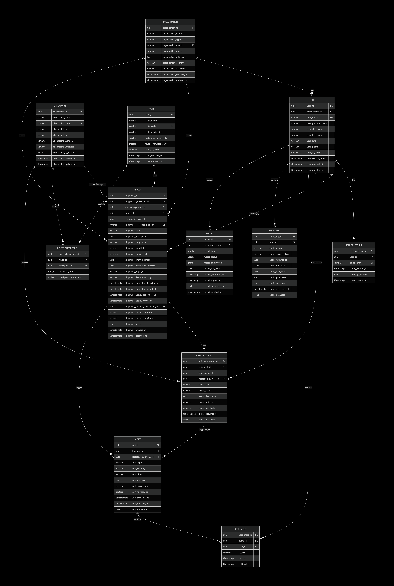

# Egypt Supply Chain Visibility (ESCV) Database

> Production-grade PostgreSQL database designed for the Egypt Supply Chain Visibility (ESCV) platform.

<div align="center">
  
</div>

---
# Table of Contents
- Overview
- Database Philosophy
- Design Principles
- Why PostgreSQL?
- Entity Relationship Diagram (ERD)
- Naming Conventions
- Primary Key Strategy
- Normalization Strategy
- Database Modules
- Table Overview
- Constraints
- Indexing Strategy
- Audit Trail
- Soft Delete Strategy
- Security Considerations
- Future Scalability
- Directory Structure

---
# Overview
The ESCV database is the central source of truth for the Egypt Supply Chain Visibility Platform.

Its responsibility is to reliably store and maintain information about:
- Organizations
- Users
- Shipments
- Shipment Events
- Routes
- Checkpoints
- Alerts
- Audit Logs

The schema is designed to provide a production-ready relational model that emphasizes:

- Data integrity
- Maintainability
- Performance
- Scalability
- Simplicity

The database follows modern PostgreSQL best practices while remaining suitable for a university capstone project.

---
# Database Philosophy
The database follows one simple principle:
> Store business data once. Reference it everywhere.

The schema intentionally avoids:
- Duplicate data
- Unnecessary complexity
- Over-normalization
- Deep inheritance hierarchies
- Excessive lookup tables

Instead, it embraces:
- Clear relationships
- Explicit naming
- Readable schemas
- Maintainable structures
- Practical normalization (approximately Third Normal Form)

---
# Design Principles
The database was designed according to the following engineering principles:

- Keep It Simple (KISS)
- Separation of Concerns
- Data Integrity
- Explicit Relationships
- Consistent Naming
- High Readability
- Production Readiness
- Easy Integration with NestJS

---
# Why PostgreSQL?
ESCV uses PostgreSQL because it provides enterprise-grade relational database capabilities while remaining open source.

Advantages include:
- Excellent relational integrity
- ACID compliance
- Advanced indexing
- Native UUID support
- JSON support
- Strong concurrency
- High performance
- Mature ecosystem
- Excellent integration with Prisma

---
# Entity Relationship Diagram (ERD)
Insert the latest ERD image below.



---
# Naming Conventions
The schema follows consistent enterprise naming conventions.

## Tables
Tables use singular names.
Example:
```js
organization
user
shipment
shipment_event
checkpoint
alert
route
```

## Columns
Columns are descriptive.
Examples:
```js
user_id
organization_id
shipment_reference_number
shipment_status
checkpoint_name
route_origin
created_at
updated_at
```

Avoid generic names such as:
```js
id
name
status
date
```

## Foreign Keys
Every foreign key uses the referenced table name.
Examples:
```js
organization_id
shipment_id
carrier_id
route_id
```

---
# Primary Key Strategy
Every table uses UUID Version 7 as its primary key.
Reasons:
- Globally unique identifiers
- Safer for distributed systems
- Better scalability
- Better index locality than UUIDv4
- Suitable for future microservice migration

Example:
```sql
shipment_id UUID PRIMARY KEY
```

---
# Normalization Strategy
The database follows approximately Third Normal Form (3NF).
Goals:
- Eliminate duplicate data
- Maintain referential integrity
- Keep queries simple
- Reduce update anomalies

The schema intentionally avoids excessive normalization that would unnecessarily increase query complexity.

---
# Database Modules
The database is divided into logical business domains.

## Authentication
Stores platform users and credentials.

## Organizations
Stores companies, government agencies, and logistics providers.

## Shipment Management
Stores shipment metadata and ownership.

## Tracking
Stores shipment movement history.

## Routes
Stores transportation routes.

## Checkpoints
Stores ports, warehouses, customs facilities, and delivery locations.

## Alerts
Stores generated notifications.

## Audit Logs
Stores append-only platform activity for auditing purposes.

---
# Table Overview
| Table | Purpose |
|---------|----------|
| organization | Registered companies and authorities |
| user | Platform users |
| shipment | Shipment metadata |
| shipment_event | Complete shipment timeline |
| checkpoint | Physical logistics locations |
| route | Transportation routes |
| alert | Shipment notifications |
| audit_log | System audit trail |

---
# Constraints
The schema enforces data integrity through:
- Primary Keys
- Foreign Keys
- NOT NULL constraints
- UNIQUE constraints
- CHECK constraints
- Default values

This ensures invalid business data cannot be inserted into the system.

---
# Indexing Strategy
Indexes are created only where they provide measurable value.

Typical indexed columns include:
- Primary Keys
- Foreign Keys
- Shipment Reference Number
- User Email
- Shipment Status
- Created At

Indexes are selected to optimize:
- Shipment lookup
- Dashboard queries
- Authentication
- Timeline retrieval

---
# Audit Trail
Shipment history is append-only.
Existing events are never modified.
Every shipment state transition creates a new Shipment Event.

Benefits:
- Complete history
- Regulatory compliance
- Easier debugging
- Historical analytics
- Full traceability

---
# Soft Delete Strategy
Business records should generally be archived rather than permanently removed.

Recommended strategy:
```sql
deleted_at TIMESTAMPTZ NULL
```

This allows:
- Data recovery
- Historical reporting
- Audit preservation

Critical business entities such as shipments should never be permanently deleted.

---
# Security Considerations
The database contributes to platform security by enforcing:
- Referential integrity
- Unique user accounts
- Strong constraints
- UUID identifiers
- Minimal redundant data

Sensitive information such as passwords is stored only as secure bcrypt hashes.

---
# Future Scalability
The schema is designed to evolve alongside the platform.
Potential future improvements include:
- Multi-country support
- Customs integration
- Fleet management
- Driver management
- Warehouse management
- IoT tracking devices
- External logistics APIs
- Advanced analytics

The current relational model supports these future enhancements with minimal structural changes.

---
# Directory Structure
```js
database/
├── erd/
│   └── escv-database-erd.png
├── schema.sql
└── README.md
```

---
## License
**PROPRIETARY LICENSE**  
© 2026 Egypt Supply Chain Visibility Team. All Rights Reserved.
This project is a university capstone project developed to demonstrate full-stack engineering skills applied to a real national infrastructure problem.

This software and associated documentation are proprietary and confidential. No part of this project may be reproduced, distributed, or transmitted in any form without prior written permission from the authors.

---
<div align="center">
  <strong>Bringing visibility to Egypt's supply chains.</strong>
</div>